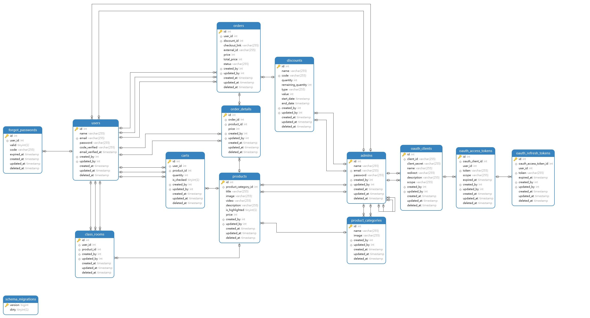

## Online Course Project v2

This project is a service for selling courses online by implementing a Domain Driven Design (DDD) approach, with this approach will focus more on business processes and easy to maintain.

[the old version](https://github.com/taufiqkba/go_online_course)

## Database Design

## Packages Used

Here are list of libraries being used in this project

- [Gin](https://gin-gonic.com/) web framework
- [Hot air reload](https://github.com/cosmtrek/air)
- [Godot env](https://github.com/joho/godotenv)
- [Gorm](https://gorm.io/) ORM library for Golang
- [Wire](https://github.com/google/wire) for Dependency Injection
- [Mailersend](https://github.com/mailersend/mailersend-go) Email Services
- [JWT](https://github.com/golang-jwt/jwt) most popular for hashing
- [Testify](https://github.com/stretchr/testify) for testing

## Progression

- Database Design
- Implement Table using Go Migrate
- Set DB connection
- Implement error response helper
- Register user service using OAuth2
- Login user service
- Setup Dependency Injection using Google Wire
- Clean up code with implement Wire
- Setup Mailersend for email verification
- Implement forgot password service
- Setup Mailersend for forgot password verification
- Implement Admin service
- Complete OAuth refresh token func
- Set integration with Cloudinary for CDN
- Implementation Middleware
- Product category service
